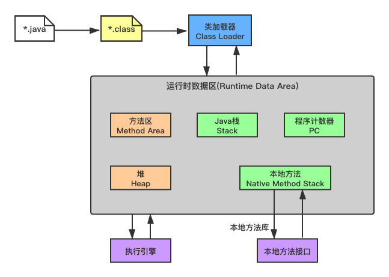
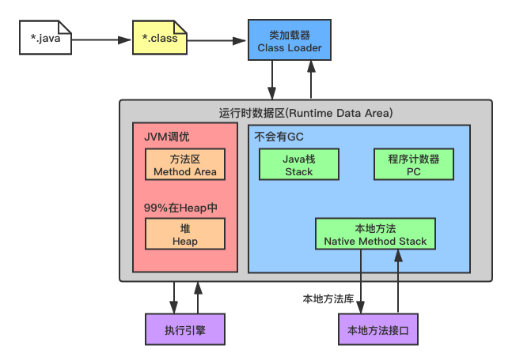
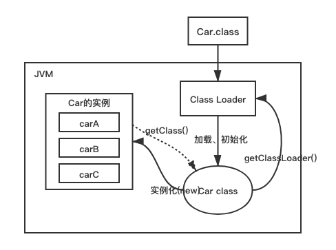
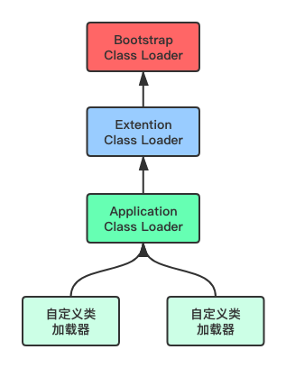

# Understanding the JVM and Design Pattern

# Java虚拟机与设计模式总结

Java虚拟机(Java Virtual Machine，简称JVM)是运行所有Java程序的抽象计算机，是Java语言的运行环境。本文是在学习《[深入理解Java虚拟机](/books)》一书之后的总结，罗列出笔者认为需要重点掌握的知识点。

## 目录

- [JVM的位置](#)
- [JVM调优的位置](#)
- [类加载器](#)
- [双亲委派机制](#)
- [沙箱安全机制](#)
- [Native](#)
- [PC寄存器](#)
- [方法区](#)
- [栈](#)
- [三种JVM](#)
- [堆](#)
- [新生区、老年区](#)
- [永久区](#)
- [堆内存调优](#)
- [GC常用算法](#)
- [JMM](#)
- [知识点总结](#)

-----

## JVM的位置


## JVM调优的位置





## 类加载器

类加载器的作用是加载Class文件，它分为以下4种：

- 虚拟机自带的加载器
- 启动类(根)加载器
- 扩展类加载器
- 应用程序加载器

**范例：**查看类和对象

```java
package cn.ustb;

public class Car {
    public static void main(String[] args) {
        // 类是模板，对象是具体
        Car carA = new Car();
        Car carB = new Car();
        Car carC = new Car();
        System.out.println("carA的HashCode：" + carA.hashCode());
        System.out.println("carB的HashCode：" + carB.hashCode());
        System.out.println("carC的HashCode：" + carC.hashCode());

        Class<? extends Car> carAClass = carA.getClass();
        Class<? extends Car> carBClass = carB.getClass();
        Class<? extends Car> carCClass = carC.getClass();
        System.out.println("carAClass的HashCode：" + carAClass.hashCode());
        System.out.println("carBClass的HashCode：" + carBClass.hashCode());
        System.out.println("carCClass的HashCode：" + carCClass.hashCode());
    }
}
```

**程序执行结果：**

```
carA的HashCode：1627674070
carB的HashCode：1360875712
carC的HashCode：1625635731
carAClass的HashCode：1639705018
carBClass的HashCode：1639705018
carCClass的HashCode：1639705018
```



**范例：**查看三种类加载器

```java
package cn.ustb;

public class Car {
    public static void main(String[] args) {
        // 类是模板，对象是具体
        Car carA = new Car();
        Class<? extends Car> carAClass = carA.getClass();
        ClassLoader classLoader = carAClass.getClassLoader();
        System.out.println("应用程序加载器：" + classLoader); // AppClassLoader
        System.out.println("扩展类加载器：" + classLoader.getParent()); // ExtClassLoader，存在于/jre/lib/ext中
        System.out.println("启动类(根)加载器：" + classLoader.getParent().getParent()); // Java程序获取不到 rt.jar中
    }
}
```

**程序执行结果：**

```
应用程序加载器：sun.misc.Launcher$AppClassLoader@18b4aac2
扩展类加载器：sun.misc.Launcher$ExtClassLoader@5e2de80c
启动类(根)加载器：null
```

## 双亲委派机制

双亲委派模型是Java加载类的机制，采用双亲委派模型的好处是Java类随着它的类加载器一起具备了一种带有优先级的层级关系，通过这种层级关系可以避免类的重复加载。



**范例：**查看双亲委派机制模型

```java
package java.lang;

public class String {
    /*
        双亲委派机制可以保证代码安全性
        通过APP-->EXC-->BOOT（最终执行）
        调用过程：
            1、类加载器收到请求
            2、将这个请求向上委托给父类加载器去完成，一直向上委托直到启动类加载器
            3、启动类加载器检查是否能够加载当前的类，能加载就使用当前加载器进行加载并结束；否则抛出异常，通知子加载器加载
            4、重复步骤3
            Class Not Found
            启动(根)加载器为null，是因为Java调用不到C、C++
            Java = C++--
     */
    public String toString() {
        return "hello";
    }

    public static void main(String[] args) {
        String str = new String();
        System.out.println(str.getClass().getClassLoader());
        System.out.println(str.toString());
    }
}
```

**程序执行结果：**

```
错误: 在类 java.lang.String 中找不到 main 方法, 请将 main 方法定义为:
   public static void main(String[] args)
否则 JavaFX 应用程序类必须扩展javafx.application.Application
```


