# Understanding the JVM and Design Pattern

# Java虚拟机与设计模式总结

Java虚拟机(Java Virtual Machine，简称JVM)是运行所有Java程序的抽象计算机，是Java语言的运行环境。本文总结了一些重点需要掌握的知识点，更多详情内容请参考《[深入理解Java虚拟机](/books)》。

## 目录

- [JVM的位置](#)
- [JVM调优的位置](#)
- [类加载器](#)
- [双亲委派机制](#)
- [沙箱安全机制](#)
- [Native](#)
- [PC寄存器](#)
- [方法区](#)
- [栈](#)
- [三种JVM](#)
- [堆](#)
- [新生区](#)
- [老年区](#)
- [永久区](#)
- [堆内存调优](#)
- [GC垃圾回收](#)
- [GC常用算法](#)
- [GC算法总结](#)
- [JMM](#)

-----

## JVM的位置


## JVM调优的位置


## 类加载器

类加载器的作用是加载Class文件，它分为以下4种：

- 虚拟机自带的加载器
- 启动类(根)加载器
- 扩展类加载器
- 应用程序加载器

**范例：** 查看类和对象

```java
package cn.ustb;

public class Car {
    public static void main(String[] args) {
        // 类是模板，对象是具体
        Car carA = new Car();
        Car carB = new Car();
        Car carC = new Car();
        System.out.println("carA的HashCode：" + carA.hashCode());
        System.out.println("carB的HashCode：" + carB.hashCode());
        System.out.println("carC的HashCode：" + carC.hashCode());

        Class<? extends Car> carAClass = carA.getClass();
        Class<? extends Car> carBClass = carB.getClass();
        Class<? extends Car> carCClass = carC.getClass();
        System.out.println("carAClass的HashCode：" + carAClass.hashCode());
        System.out.println("carBClass的HashCode：" + carBClass.hashCode());
        System.out.println("carCClass的HashCode：" + carCClass.hashCode());
    }
}
```

**程序执行结果：**

```
carA的HashCode：1627674070
carB的HashCode：1360875712
carC的HashCode：1625635731
carAClass的HashCode：1639705018
carBClass的HashCode：1639705018
carCClass的HashCode：1639705018
```


**范例：** 查看三种类加载器

```java
package cn.ustb;

public class Car {
    public static void main(String[] args) {
        // 类是模板，对象是具体
        Car carA = new Car();
        Class<? extends Car> carAClass = carA.getClass();
        ClassLoader classLoader = carAClass.getClassLoader();
        System.out.println("应用程序加载器：" + classLoader); // AppClassLoader
        System.out.println("扩展类加载器：" + classLoader.getParent()); // ExtClassLoader，存在于/jre/lib/ext中
        System.out.println("启动类(根)加载器：" + classLoader.getParent().getParent()); // Java程序获取不到 rt.jar中
    }
}
```

**程序执行结果：**

```
应用程序加载器：sun.misc.Launcher$AppClassLoader@18b4aac2
扩展类加载器：sun.misc.Launcher$ExtClassLoader@5e2de80c
启动类(根)加载器：null
```

## 双亲委派机制

双亲委派模型是Java加载类的机制，采用双亲委派模型的好处是Java类随着它的类加载器一起具备了一种带有优先级的层级关系，通过这种层级关系可以避免类的重复加载。


**范例：** 查看双亲委派机制模型

```java
package java.lang;

public class String {
    /*
        双亲委派机制可以保证代码安全性
        通过APP-->EXC-->BOOT（最终执行）
        调用过程：
            1、类加载器收到请求
            2、将这个请求向上委托给父类加载器去完成，一直向上委托直到启动类加载器
            3、启动类加载器检查是否能够加载当前的类，能加载就使用当前加载器进行加载并结束；否则抛出异常，通知子加载器加载
            4、重复步骤3
            Class Not Found
            启动(根)加载器为null，是因为Java调用不到C、C++
            Java = C++--
     */
    public String toString() {
        return "hello";
    }

    public static void main(String[] args) {
        String str = new String();
        System.out.println(str.getClass().getClassLoader());
        System.out.println(str.toString());
    }
}
```

**程序执行结果：**

```
错误: 在类 java.lang.String 中找不到 main 方法, 请将 main 方法定义为:
   public static void main(String[] args)
否则 JavaFX 应用程序类必须扩展javafx.application.Application
```

## 沙箱安全机制

Java安全模型的核心就是Java沙箱，它是一个限制程序运行的环境。沙箱机制就是将 Java 代码限定在JVM特定的运行范围中，并且严格限制代码对本地系统资源访问，通过这样的措施来保证对代码的有效隔离，防止对本地系统造成破坏。沙箱**主要限制系统资源访问**，这里的系统资源包括CPU、内存、文件系统和网络。

  所有的Java程序运行都可以指定沙箱，来定制安全策略。

## Native

**范例：** 编写一个多线程启动类

```java
package cn.ustb;

public class NativeDemo {
    public static void main(String[] args) {
        new Thread(()->{

        }, "myThread").start();
    }

    /*
        1、凡是带有native关键字，就说明Java的范围达不到了，调用的是底层C语言的库；
        2、它会进入本地方法栈，会调用JNI接口，从而调用本地方法库，来扩展Java的使用；
        3、本地方法接口，JNI(Java Native Interface)；
        4、JNI的作用：扩展Java的使用，融合不同的编程语言为Java所用；
        5、Java在内存区域中专门开辟了一块标记区域：Native Method Stack来登记native方法；
        6、在最终执行的时候，通过JNI加载本地方法库中的方法，例如Java程序驱动打印机。
     */
    private native void start0();

}
```

**范例：** 查看start方法的源码

```java
public synchronized void start() {
    if (threadStatus != 0)
        throw new IllegalThreadStateException();

    group.add(this);

    boolean started = false;
    try {
        start0();
        started = true;
    } finally {
        try {
            if (!started) {
                group.threadStartFailed(this);
            }
        } catch (Throwable ignore) {
        }
    }
}

// 注意native关键字
private native void start0();
```

**JNI：Java Native Interface(Java本地方法接口)**

在Java程序中，凡是带有native关键字，就说明Java调用的底层C语言的库；它会进入本地方法栈，会调用JNI接口，从而调用本地方法库，来扩展Java的使用；JNI的作用：扩展Java的使用，融合不同的编程语言为Java所用；JVM会在在内存区域中专门开辟了一块标记区域：Native Method Stack来登记native方法；在最终执行的时候，通过JNI加载本地方法库中的方法，如：Java程序驱动打印机。

## PC寄存器

**程序计数器：Program Counter Register**

每个线程都有一个程序计数器，是线程私有的，它就是一个指针，指向方法区中的方法字节码（用来存储指向一条指令的地址，也就是要执行的指令代码），用于执行引擎读取下一条指令，占用非常小的内存空间，可忽略不计。

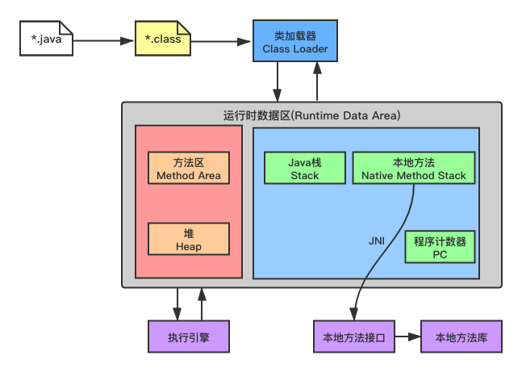

## 方法区

**方法区：Method Area**

方法区是被所有线程共享，所有字段和方法字节码，以及一些特殊方法，如构造函数，接口代码也在此定义。简单地说，所有定义的方法信息都保存在该区域，**此区域属于共享区域**。

**静态变量(static)、常量(final)、类信息(构造方法、接口定义)、运行时的常量池也保存在方法区中。但是实例变量存在堆内存中，和方法区无关。**

**方法区保存：static、final、Class、常量池。**

**范例：** 创建一个Student类

```java
package cn.ustb;

public class Student {
    private int age;
    private String name = "ALLEN";

    public static void main(String[] args) {
        Student stu = new Student();
        stu.age = 10;
        stu.name = "SMITH";
    }
}
```

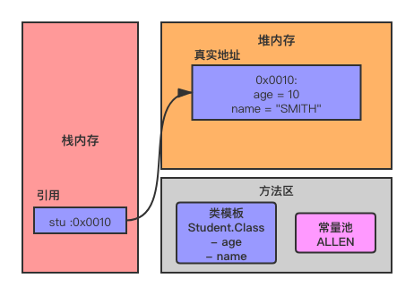

## 栈

**栈是一种数据结构，又称栈内存，主管程序的运行，生命周期和线程同步。** 线程结束，栈内存也就释放了。对于栈来说，不存在垃圾回收问题，一旦线程结束，栈就结束了。

**栈帧(Stack Frame)**，是用于虚拟机执行时方法调用和方法执行时的数据结构，它是Java虚拟栈的基本元素。

虚拟机只会直接对Java栈执行两种操作：以帧为单位的压栈和出栈。

每当线程调用一个Java方法时，虚拟机都会在该线程的Java栈中压入一个新帧。而这个新帧自然就成为了当前帧。在执行这个方法时，它使用这个帧来存储参数、局部变量、中间运算结果等数据。

Java方法可以以两种方式完成。一种通过return返回的，称为正常返回；另一种是通过抛出异常而异常终止的。不管以哪种方式返回，虚拟机都会将当前帧弹出Java栈然后释放掉，这样上一个方法的帧就成为当前帧了。

栈溢出：**StackOverflowError**。

**栈内存保存：8大基本类型、对象的引用、实例的方法。**

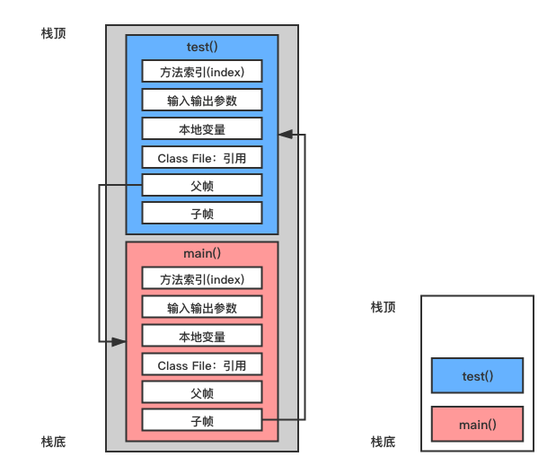

在内存中的对象实例化过程，突出栈+堆+方法区交互关系。

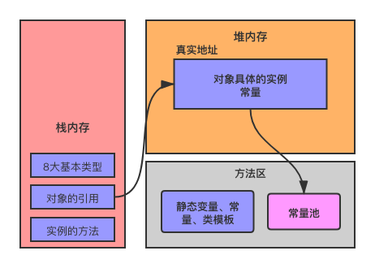

## 三种JVM

- SUN公司：`HotSpot`
- BEA公司：`JRockit`
- IBM公司：`J9 VM`

## 堆

堆(Heap)，一个JVM只有一个堆内存，堆内存的大小是可以调节的。

类加载器读取类文件后，一般会把类、方法、变量、常量保存到堆中，堆中保存的是引用类型的真实对象。

堆内存中可以分为以下三个区域：

- **新生区**：YoungGen
- **养老区**：OldGen
- **永久区**：PermGen

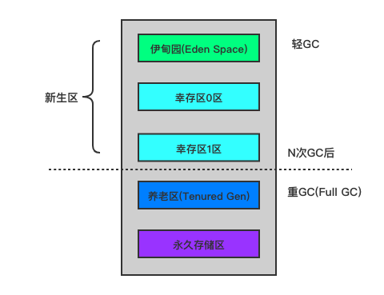

GC垃圾回收，主要针对的是新生区和养老区进行的。

堆溢出：**OutOfMemoryError**。

**范例：** 堆内存溢出

```java
package cn.ustb;
import java.util.Random;

public class HeapDemo {
    public static void main(String[] args) {
        String str = "Hello World!!!";
        while (true) {
            str += str + new Random().nextInt(888888888) + new Random().nextInt(888888888);
        }
    }
}
```

**程序执行结果：**

```
Exception in thread "main" java.lang.OutOfMemoryError: Java heap space
	at java.util.Arrays.copyOf(Arrays.java:3332)
	at java.lang.AbstractStringBuilder.ensureCapacityInternal(AbstractStringBuilder.java:124)
	at java.lang.AbstractStringBuilder.append(AbstractStringBuilder.java:674)
	at java.lang.StringBuilder.append(StringBuilder.java:208)
	at cn.ustb.HeapDemo.main(HeapDemo.java:9)
```

在JDK1.8版本废弃了永久区，替代的是元空间(MetaSpace)，元空间与永久区上类似，都是方法区的实现，最大的区别是：元空间并不在JVM中，而是使用本地内存。

移除永久区原因：为融合HotSpot JVM与JRockit VM而做出的改变，因为JRockit没有永久区。有了元空间就不再会出现永久区OOM问题了！

## 新生区

一个类在新生区中可能是诞生、成长和死亡。

伊甸园区：所有的对象都是在伊甸园区创建(new)出来。当伊甸园区满时，会触发一次轻GC。

幸存者区：幸存者区(Survival)与伊甸园区(Eden)相同都在Java堆的新生区。Survival区有两块，一块称为from区，另一块为to区，这两个区是相对的，在发生一次Minor GC后，from区就会和to区互换。在发生Minor GC时，Eden区和Survival from区会把一些仍然存活的对象复制进Survival to区，并清除内存。Survival to区会把一些存活得足够旧的对象移至老年区。

## 老年区

老年区里存放的都是存活时间较久的，大小较大的对象，因此老年区使用标记整理算法。当老年区容量满的时候，会触发一次Major GC(Full GC)，回收老年区和新生区中不再被使用的对象资源。

## 永久区

永久区是常驻内存的，一般用来存放JDK自身携带的Class对象，包括接口元数据，存储的是一些Java运行时的环境或类信息，永久区不存在垃圾回收，关闭虚拟机就会释放内存。

当一个启动类加载了大量的第三方JAR包、Tomcat部署了太多的应用、大量动态生成的反射类都会导致堆溢出(OOM)。

|  JDK版本   |           永久区的变化           |
| :--------: | :------------------------------: |
| JDK1.6之前 |      永久代，常量池在方法区      |
|   JDK1.7   | 永久代，去永久代，常量池在堆内存 |
| JDK1.8之后 |     无永久代，常量池在元空间     |

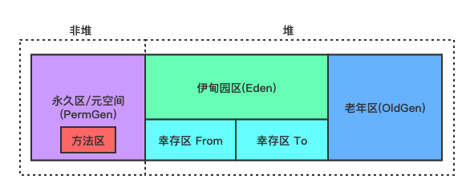

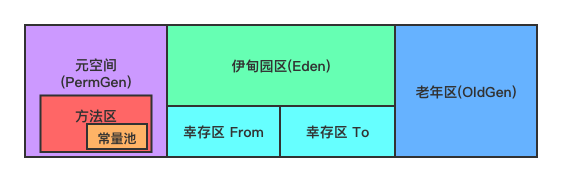

元空间：**逻辑上存在，物理上不存在。**

**范例：** 查看JVM参数

```java
package cn.ustb;

public class HeapOptDemo {
    public static void main(String[] args) {
        long maxMemory = Runtime.getRuntime().maxMemory();// 返回JVM可以使用的最大内存
        long totalMemory = Runtime.getRuntime().totalMemory();// 返回JVM的总内存
        /*
            默认情况下，初始化内存占本机的1/64，可使用的最大内存占本机的1/4
         */
        System.out.println("JVM可使用的最大内存为：" + maxMemory + "字节，约为" + (maxMemory/(double)1024/1024) + "MB");
        System.out.println("JVM的总内存为：" + maxMemory + "字节，约为" + (totalMemory/(double)1024/1024) + "MB");
    }
}

```

**程序执行结果：**

```
JVM可使用的最大内存为：954728448字节，约为910.5MB
JVM的总内存为：954728448字节，约为61.5MB
```

默认情况下，初始化内存占本机的1/64，可使用的最大内存占本机的1/4。

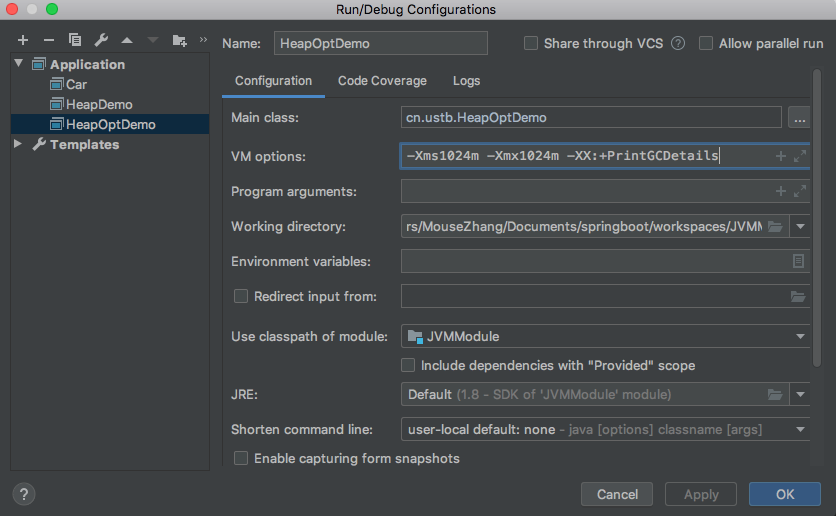

**程序执行结果：**

```
JVM可使用的最大内存为：1029177344字节，约为981.5MB
JVM的总内存为：1029177344字节，约为981.5MB
Heap
 PSYoungGen      total 305664K, used 15729K [0x00000007aab00000, 0x00000007c0000000, 0x00000007c0000000)
  eden space 262144K, 6% used [0x00000007aab00000,0x00000007aba5c420,0x00000007bab00000)
  from space 43520K, 0% used [0x00000007bd580000,0x00000007bd580000,0x00000007c0000000)
  to   space 43520K, 0% used [0x00000007bab00000,0x00000007bab00000,0x00000007bd580000)
 ParOldGen       total 699392K, used 0K [0x0000000780000000, 0x00000007aab00000, 0x00000007aab00000)
  object space 699392K, 0% used [0x0000000780000000,0x0000000780000000,0x00000007aab00000)
 Metaspace       used 3129K, capacity 4496K, committed 4864K, reserved 1056768K
  class space    used 343K, capacity 388K, committed 512K, reserved 1048576K
```

**设置运行的堆内存参数：** `-Xms1024m -Xmx1024m -XX:+PrintGCDetails`

**出现OOM情况时分析步骤：**

- 尝试扩大堆内存查看程序运行情况
- 若还出现OOM，分析原因，找出有问题的代码修改(专业工具)

**范例：** 查看OOM的输出情况

```java
package cn.ustb;
import java.util.Random;

// -Xms8m -Xmx8m -XX:+PrintGCDetails
public class HeapDemo {
    public static void main(String[] args) {
        String str = "Hello World!!!";
        while (true) {
            str += str + new Random().nextInt(888888888) + new Random().nextInt(888888888);
        }
    }
}
```

**程序执行结果：**

```
[GC (Allocation Failure) [PSYoungGen: 1522K->495K(2048K)] 1522K->503K(7680K), 0.0482829 secs] [Times: user=0.01 sys=0.00, real=0.05 secs] 
[GC (Allocation Failure) [PSYoungGen: 1929K->507K(2048K)] 1937K->788K(7680K), 0.0018254 secs] [Times: user=0.01 sys=0.01, real=0.00 secs] 
[GC (Allocation Failure) [PSYoungGen: 1571K->507K(2048K)] 1853K->1056K(7680K), 0.0016456 secs] [Times: user=0.00 sys=0.00, real=0.00 secs] 
[GC (Allocation Failure) [PSYoungGen: 1562K->288K(2048K)] 3116K->2344K(7680K), 0.0013597 secs] [Times: user=0.00 sys=0.00, real=0.00 secs] 
[Full GC (Ergonomics) [PSYoungGen: 840K->0K(2048K)] [ParOldGen: 5071K->2877K(5632K)] 5911K->2877K(7680K), [Metaspace: 3063K->3063K(1056768K)], 0.0060981 secs] [Times: user=0.01 sys=0.00, real=0.01 secs] 
[GC (Allocation Failure) [PSYoungGen: 1040K->96K(2048K)] 4923K->4983K(7680K), 0.0006954 secs] [Times: user=0.00 sys=0.00, real=0.00 secs] 
[Full GC (Ergonomics) [PSYoungGen: 96K->0K(2048K)] [ParOldGen: 4887K->2376K(5632K)] 4983K->2376K(7680K), [Metaspace: 3069K->3069K(1056768K)], 0.0054872 secs] [Times: user=0.02 sys=0.00, real=0.00 secs] 
[GC (Allocation Failure) [PSYoungGen: 39K->96K(2048K)] 4426K->4482K(7680K), 0.0008183 secs] [Times: user=0.00 sys=0.00, real=0.00 secs] 
[GC (Allocation Failure) [PSYoungGen: 96K->64K(2048K)] 4482K->4450K(7680K), 0.0004159 secs] [Times: user=0.00 sys=0.00, real=0.00 secs] 
[Full GC (Allocation Failure) [PSYoungGen: 64K->0K(2048K)] [ParOldGen: 4386K->3382K(5632K)] 4450K->3382K(7680K), [Metaspace: 3083K->3083K(1056768K)], 0.0064401 secs] [Times: user=0.02 sys=0.00, real=0.00 secs] 
[GC (Allocation Failure) [PSYoungGen: 0K->0K(2048K)] 3382K->3382K(7680K), 0.0005774 secs] [Times: user=0.00 sys=0.00, real=0.00 secs] 
[Full GC (Allocation Failure) [PSYoungGen: 0K->0K(2048K)] [ParOldGen: 3382K->3362K(5632K)] 3382K->3362K(7680K), [Metaspace: 3083K->3083K(1056768K)], 0.0065209 secs] [Times: user=0.02 sys=0.00, real=0.01 secs] 
Heap
 PSYoungGen      total 2048K, used 85K [0x00000007bfd80000, 0x00000007c0000000, 0x00000007c0000000)
  eden space 1536K, 5% used [0x00000007bfd80000,0x00000007bfd954d8,0x00000007bff00000)
  from space 512K, 0% used [0x00000007bff80000,0x00000007bff80000,0x00000007c0000000)
  to   space 512K, 0% used [0x00000007bff00000,0x00000007bff00000,0x00000007bff80000)
 ParOldGen       total 5632K, used 3362K [0x00000007bf800000, 0x00000007bfd80000, 0x00000007bfd80000)
  object space 5632K, 59% used [0x00000007bf800000,0x00000007bfb48ad8,0x00000007bfd80000)
 Metaspace       used 3125K, capacity 4496K, committed 4864K, reserved 1056768K
  class space    used 344K, capacity 388K, committed 512K, reserved 1048576K
Exception in thread "main" java.lang.OutOfMemoryError: Java heap space
	at java.util.Arrays.copyOf(Arrays.java:3332)
	at java.lang.AbstractStringBuilder.ensureCapacityInternal(AbstractStringBuilder.java:124)
	at java.lang.AbstractStringBuilder.append(AbstractStringBuilder.java:674)
	at java.lang.StringBuilder.append(StringBuilder.java:208)
	at cn.ustb.HeapDemo.main(HeapDemo.java:9)

```

## 堆内存调优

在项目开发中，如果程序突然出现OOM，排除故障的方式可以为：

- 使用内存快照分析工具，如：MAT、JProfiler等找出代码在第几行出错
- Debug，一行一行分析代码...

MAT、JProfiler工具的作用：

- 分析Dump内存文件，快速定位内存泄漏问题
- 查看堆内存中的数据
- 查看占用堆中的大对象

**范例：** 创建HeapDumpDemo程序

```java
package cn.ustb;
import java.util.ArrayList;
import java.util.List;

// -Xms1m -Xmx8m -XX:+HeapDumpOnOutOfMemoryError
public class HeapDumpDemo {

    byte[] array = new byte[1*1024*1024]; // 1MB

    public static void main(String[] args) {
        List<HeapDumpDemo> list = new ArrayList<>();
        int count = 0; // 用于记录代码出错的行数
        try {
            while (true) {
                list.add(new HeapDumpDemo());
                count++;
            }
        } catch (Error e) {
            System.out.println("count = " + count);
            e.printStackTrace();
        }
    }
}
```

**设置运行的堆内存参数：** `-Xms1m -Xmx8m -XX:+HeapDumpOnOutOfMemoryError`

**程序执行结果：**

```
java.lang.OutOfMemoryError: Java heap space
Dumping heap to java_pid32038.hprof ...
Heap dump file created [6290447 bytes in 0.058 secs]
count = 5
java.lang.OutOfMemoryError: Java heap space
	at cn.ustb.HeapDumpDemo.<init>(HeapDumpDemo.java:8)
	at cn.ustb.HeapDumpDemo.main(HeapDumpDemo.java:15)
```

使用JProfiler查看Dump文件。

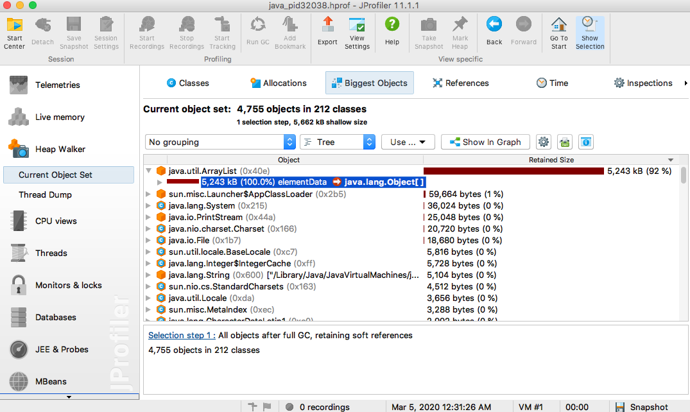

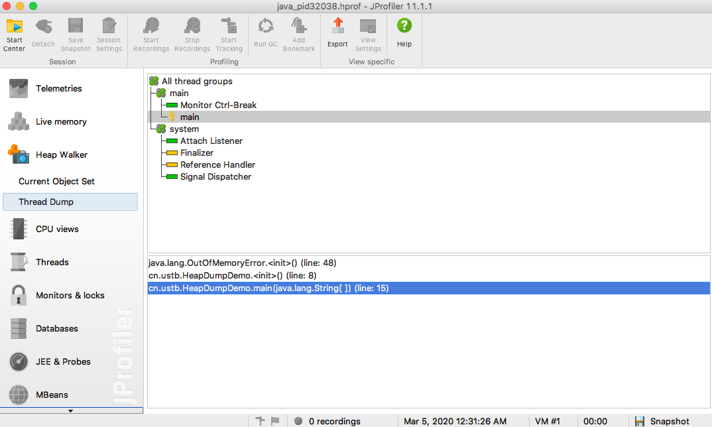

**常见的堆内存参数**

- **-Xms**：设置初始化内存分配大小(1/64)
- **-Xmx**：设置可分配的最大内存(1/4)
- **-XX:+PrintGCDetails**：打印GC垃圾回收信息
- **-XX:+HeapDumpOnOutOfMemoryError**：OOM Dump

## GC垃圾回收

GC常见面试题：

- 详细描述JVM的内存模型和分区？
- 堆里面的分区有哪些，并说出它们的特点？
- GC的算法和使用场景？
- 轻GC和重GC分别在什么时候发生？

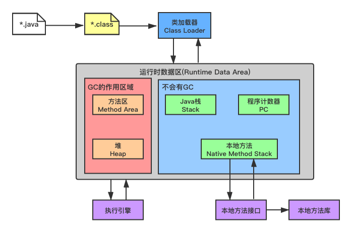

JVM在进行GC的时候，并不是对伊甸园区、幸存区和老年区进行统一回收，大部分时候在回收的时候针对伊甸园区进行。

GC两种分类：

- 轻GC(普通GC)，大部分针对伊甸园区，少量是幸存区
- 重GC(全局GC)，对三个区进行回收

## GC常用算法

GC的常用算法包括：

- 标记清除法
- 标记压缩法
- 复制算法
- 引用计数法

### 标记清除法

标记清除算法的执行过程分为两个阶段：标记阶段、清除阶段。

- 标记阶段会标记出所有需要回收的对象
- 清除阶段会将标记阶段标记的垃圾对象清除

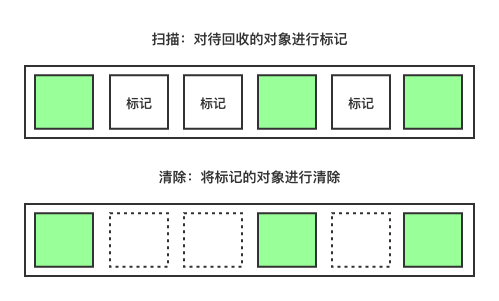

标记清除法的优点：不需要开辟额外的内存空间；缺点：需要两次扫描，浪费时间，还会产生内存碎片。

### 标记压缩法

标记压缩算法又称标记清除压缩算法，它是对标记清除法的优化，用于解决标记清除算法的内存碎片问题。

- 标记垃圾对象
- 清除垃圾对象
- 内存碎片整理


**改进：** 先标记几次，再统一压缩，节省时间。

### 复制算法

幸存区(Survivor)，一块叫From，一块叫To，对象存在伊甸园区(Eden)和From块。当进行GC时，Eden存活的对象全移到To块，而From中，存活的对象按年龄值确定去向，当达到一定值(年龄阈值)的对象会移到老年区中，没有达到值的复制到To区，经过GC后，Eden和From被清空。之后，From和To交换角色，新的From即为原来的To块，新的To块即为原来的From块，且新的To块中对象年龄加1。

年龄阈值设置参数：`-XX:MaxTenuringThreshold`

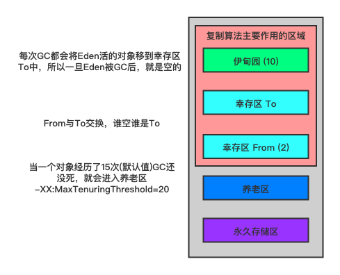

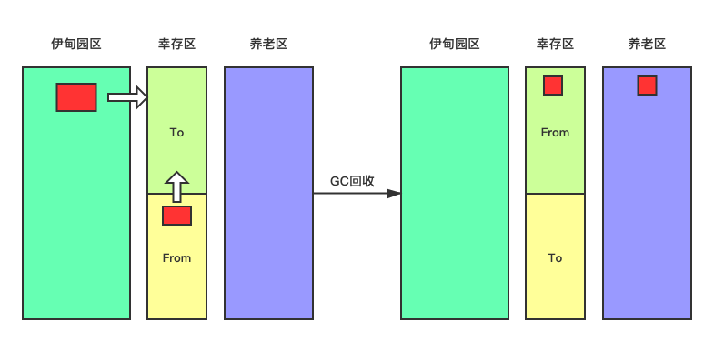

GC复制算法优点：不会出现内存碎片；缺点：浪费内存空间(多了一半空着的To区)，在极端情况下(对象100%存活)。

GC复制算法的最佳使用场景：**在对象存活度较低的新生区使用。**

### 引用计数法

引用计数是垃圾收集的早期策略。在这种方法中，堆中每一个对象都有一个引用计数。一个对象被创建了，并且指向该对象的引用被分配给一个变量，这个对象的引用计数被置为1。当任何其他变量被赋值为对这个对象的引用时，计数加1。当一个对象的引用超过了生存期或者被设置一个新的值时，对象的引用计数减1。任何引用计数为0的对象可以被当作垃圾收集。当一个对象被垃圾收集的时候，它引用的任何对象计数值减1。任何时刻计数器为0的对象就是不可能再被使用的。

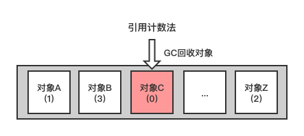

## GC算法总结

**时间复杂度：** 复制算法 > 标记清除算法 > 标记压缩算法

**内存整齐度：** 复制算法 = 标记压缩算法 > 标记清除算法

**内存利用率：** 标记压缩算法 = 标记清除算法 > 复制算法

因此，没有最优的算法，只有最合适的算法，GC算法又称为分代收集算法。

|  分区  |       特点       |         方法          |
| :----: | :--------------: | :-------------------: |
| 新生区 |     存活率低     |       复制算法        |
| 老年区 | 区域大、存活率高 | 标记清除+标记压缩混合 |

## JMM

Java Memory Model