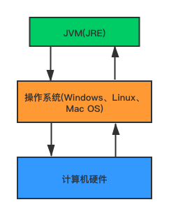

# Understanding the JVM and Design Pattern

# Java虚拟机与设计模式总结

Java虚拟机(Java Virtual Machine，简称JVM)是运行所有Java程序的抽象计算机，是Java语言的运行环境。本文是在学习《[深入理解Java虚拟机](/books)》一书之后的总结，罗列出笔者认为需要重点掌握的知识点。

## 目录

- [JVM的位置](#)
- [JVM的体系结构](#)
- [类加载器](#)
- [双亲委派机制](#)
- [沙箱安全机制](#)
- [Native](#)
- [PC寄存器](#)
- [方法区](#)
- [栈](#)
- [三种JVM](#)
- [堆](#)
- [新生区、老年区](#)
- [永久区](#)
- [堆内存调优](#)
- [GC常用算法](#)
- [JMM](#)
- [知识点总结](#)

-----

## JVM的位置

## JVM的体系结构

## 类加载器